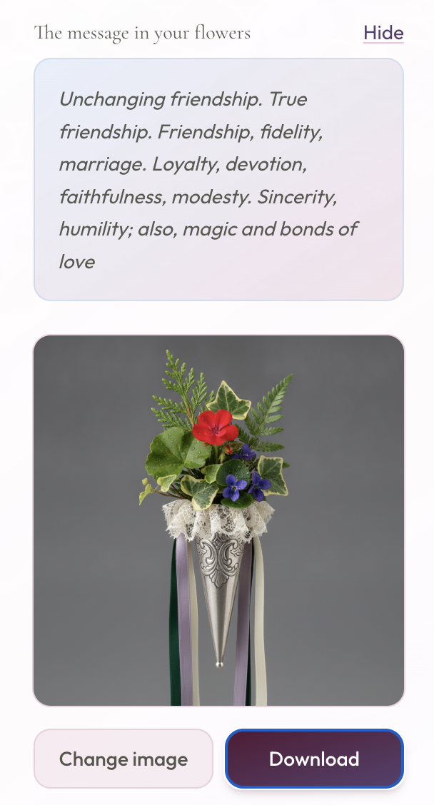
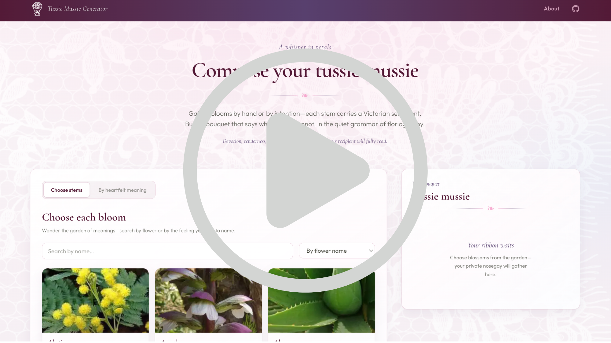

# 💐 Tussie-Mussie Generator

Welcome to **The Tussie-Mussie Generator** – a charming web app that lets you create and share AI-generated Victorian-style digital bouquets (bouquAIs), also known as *tussie-mussies*. Each flower in your arrangement carries a symbolic message, inspired by the historic *language of flowers* 🌸✨ Download your bouquet image or send an **e-card** (when you configure the optional worker URL below).

🖥️ **Create your BouquAI here:** [https://tussie-mussies.netlify.app/](https://tussie-mussies.netlify.app/)

## 🌼 What is a Tussie-Mussie?

A tussie-mussie is a small bouquet traditionally used to convey coded sentiments. Popularized by Queen Victoria, they are the ultimate "love code". With this app, you can recreate this experience and compose your own bouquet using symbolic flowers, then save or share it as a unique, personalized message.




## ✨ Features

- 🌷 Compose custom bouquets with meaningful flowers
- 📖 Learn what each flower symbolizes
- Create by meaning or individually
- Download your generated bouquet image
- Send an HTML e-card by email (via a small [Cloudflare Worker](workers/send-ecard/) + [Resend](https://resend.com); no Netlify serverless usage)

## Demo

[](https://youtu.be/L8H4SnNUeDs) "Demo video")

## 🛠 Tech Stack

- [Astro](https://astro.build/) – static site builder
- [Vue 3](https://vuejs.org/) – bouquet builder component
- [Cloudinary](https://cloudinary.com/) – for storing generated bouquet images
- 🤖 Images generated with the [Gemini API](https://ai.google.dev/gemini-api/docs/image-generation) (native image model, same key as Google AI Studio)
- ✉️ E-cards: [Cloudflare Worker](workers/send-ecard/) + [Resend](https://resend.com) (API key stored only on Cloudflare)

## 🛠 Environment Variables

To run this app, you need to set up the following environment variables in a `.env` file at the root of your project:

```
PUBLIC_CLOUDINARY_CLOUD_NAME=your_cloud_name
CLOUDINARY_API_KEY=your_cloudinary_api_key
CLOUDINARY_API_SECRET=your_cloudinary_api_secret
CLOUDINARY_PRESET=your_cloudinary_preset

GEMINI_API_KEY=your_gemini_api_key
# Create at https://aistudio.google.com/apikey

# Optional — enables “Send e-card” in the bouquet preview after you deploy the Worker:
PUBLIC_ECARD_API_URL=https://your-worker.workers.dev
```

- `PUBLIC_CLOUDINARY_CLOUD_NAME`: Your Cloudinary cloud name (used for image URLs in the UI and for the derived unsigned upload endpoint `https://api.cloudinary.com/v1_1/<name>/image/upload`)
- `CLOUDINARY_API_KEY` and `CLOUDINARY_API_SECRET`: Used for uploading images to Cloudinary (server-side or scripts)
- `PUBLIC_ECARD_API_URL`: Base URL of the Cloudflare Worker that sends mail through Resend. If unset, the e-card UI is hidden. See [workers/send-ecard/README.md](workers/send-ecard/README.md).

> **Note:** Only variables prefixed with `PUBLIC_` are available in the browser (client-side code). The Resend API key must **only** be configured as a Worker secret in Cloudflare, never in this repo.

### E-card Worker (Cloudflare)

Deploy instructions, Resend setup, and CORS configuration are in **[workers/send-ecard/README.md](workers/send-ecard/README.md)**. After `npm run deploy` in that folder, set `PUBLIC_ECARD_API_URL` in Netlify (and locally in `.env`) to your Worker URL, and add your site origin to the Worker’s `ALLOWED_ORIGINS` variable.

When hosting your web site, make sure to save the environment variables according to best practices of your hosting provider.

## 🚀 Running the App

1. **Install dependencies:**
   ```sh
   npm install
   ```
2. **Set up your `.env` file** as described above.
3. **Start the development server:**
   ```sh
   npm run dev
   ```
4. **Open your browser** and go to the URL shown in the terminal (often [http://localhost:4321](http://localhost:4321))

To build for production:
```sh
npm run build
npm run preview
```

## Production checklist

Ship order: **Worker first** (so you have a real `PUBLIC_ECARD_API_URL`), then **site**.

### 1. Cloudflare Worker (`workers/send-ecard/`)

| Step | Action |
|------|--------|
| Deploy | `cd workers/send-ecard && npm install && npm run deploy` — note the `https://….workers.dev` URL. |
| Secret | `npx wrangler secret put RESEND_API_KEY` (or Cloudflare dashboard → Worker → **Secrets**) — production does **not** use `.dev.vars`. |
| CORS | In **`wrangler.toml`** `[vars]` → **`ALLOWED_ORIGINS`**: comma-separated list of **exact** browser origins that will load the app (scheme + host + port). Include your live site, e.g. `https://tussie-mussies.netlify.app`. Add `https://www.yourdomain.com` too if you use www. **Redeploy** after changing `wrangler.toml`. |
| From address | For real deliverability, verify a domain in [Resend](https://resend.com) and set **`FROM_EMAIL`** in the Worker (Wrangler `[vars]` or Cloudflare dashboard) to e.g. `Tussie Mussie <hello@yourdomain.com>`. `onboarding@resend.dev` is only for limited testing. |

Details: [workers/send-ecard/README.md](workers/send-ecard/README.md).

### 2. Netlify (or your static host)

Set **Site configuration → Environment variables** (build + runtime for Astro client env):

| Variable | Required | Notes |
|----------|----------|--------|
| `PUBLIC_CLOUDINARY_CLOUD_NAME` | Yes | Same as local. |
| `CLOUDINARY_PRESET` | Yes | Unsigned upload preset used by the browser uploader. |
| `GEMINI_API_KEY` | Yes* | *Needed for “Generate image”. Optional only if you ship without AI. |
| `PUBLIC_ECARD_API_URL` | Optional | Full Worker URL, e.g. `https://tussie-mussie-send-ecard.<subdomain>.workers.dev`. If unset, the e-card block stays hidden. |

`CLOUDINARY_API_KEY` / `CLOUDINARY_API_SECRET` are **not** used by the Astro app at runtime (only by `upload_images_to_cloudinary.py`); you do **not** need them on Netlify for the site to build and run.

Trigger a **new deploy** after changing variables.

### 3. Smoke test after deploy

1. Open the **production** site URL (same origin you put in `ALLOWED_ORIGINS`).
2. Add flowers → **Generate image** → **Send e-card** to yourself.
3. If the browser reports **403** / “Origin not allowed”, the live URL does not match **`ALLOWED_ORIGINS`** exactly (including `http` vs `https`).

### Security note (Gemini)

`GEMINI_API_KEY` is exposed to the browser bundle (`astro:env` client). For a public app, treat it as **revocable** and monitor quota; a stricter setup would move image generation behind your own server later.

&copy; Jen Looper - MIT License
